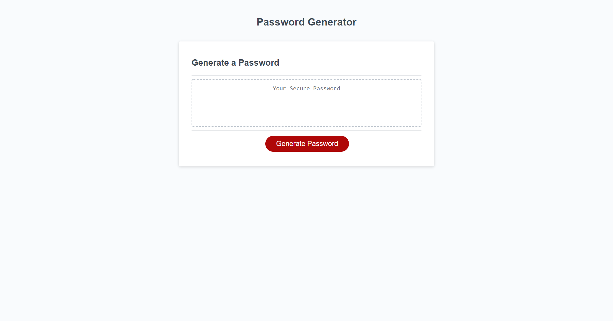

# 03-JavaScript-Password-Generator

## Description

The purpose of this game is to simulate how to randomly create a password for a user after asking a few questions. The program will ask how long the user wants their password to be within a certain numeric range. The user will proceed through several prompts asking the different types of characters they want included in their password. This program will then use a mathematical formula to generate a randomized password and print it in the text box. This password generator is programmed to ensure that the user follows the proper design in creating a correct password. This program uses if statements, for loops, and for...of loops.

## Mock-Up

The following image shows a demonstration of what the finished web application's presentation and functionality will include:

## Prerequisites

Before you continue, make sure you have the following requirements:

- You have Visual Studio Code downloaded.
- You are using a MAC OS or Windows machine.
- You have a basic understanding of HTML and CSS.

## Links

[This is a URL link to the deployed application.](https://bungycode.github.io/JavaScript-Password-Generator/)

[This is a URL link to the github repository](https://github.com/Bungycode/JavaScript-Password-Generator)